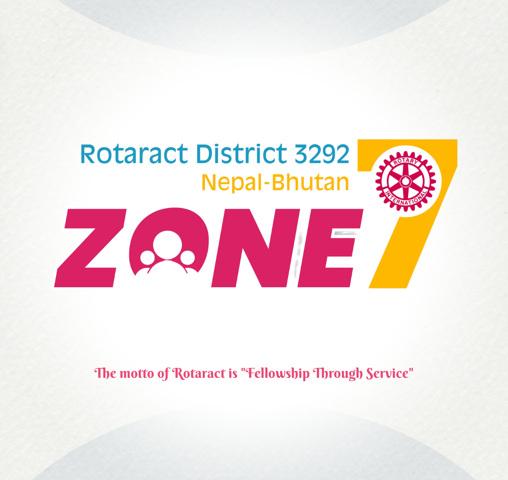

<p align="center">
  
</p>

<p align="center">
  
</p>

<h1 align="center">ZONE 7 · ROTARACT DISTRICT 3292</h1>

<p align="center">
  <strong>Nepal 🇳🇵 · Bhutan 🇧🇹</strong> &nbsp;|&nbsp; 9 Rotaract clubs across the Kathmandu Valley, united in service.
</p>

<p align="center">
  <a href="https://zone7rotaract3292.vercel.app/" target="_blank"></a>
  <a href="https://ri3292zone7-cloud.github.io/zone7rotaract3292/" target="_blank"></a>
  <a href="https://www.instagram.com/zone7rotaract3292/" target="_blank"></a>
  <a href="https://opensource.org/licenses/MIT" target="_blank"></a>
</p>

<p align="center">
  
  
  
  
</p>

---

> ## 🫶 This is YOUR website.
>
> **Zone 7 Rotaract is completely open source.** That's not a marketing line, we mean it. Any Rotaractor, any club board, any alumni, any curious friend of the zone can fork this repository and start tinkering. Fix a typo. Clean up some code. Dream up a feature nobody asked for. Translate a page into Nepali. Even just rewrite a confusing paragraph. This site belongs to the nine clubs of Zone 7, not to any one person. So go ahead. Your pull request is genuinely welcome. 🚀

---

## 🌄 Who We Are

**Rotaract is Rotary International's club for young adults aged 18 to 30.** A local Rotary club sponsors us, but we run the whole thing ourselves. Zone 7 gathers **9 Rotaract clubs** from across the Kathmandu Valley, all under **Rotary International District 3292 (Nepal and Bhutan)**.

We're not a single club with a single crowd. We're nine of them. From the busy lanes of Makkhan Tol to the quiet hills of Sankhu, our members show up week after week. A blood donation drive on a rainy Saturday. A river clean-up before the festival season. A futsal night that turns into a friendly grudge match. Sometimes it's a serious board meeting. Sometimes it's just laughing over chiya after a project. That mix, that's what Zone 7 is.

---

## 📊 Zone 7 At a Glance

| | |
|---|---|
| 🗺️ **Zones** | Zone 7, Rotaract District 3292 (Nepal 🇳🇵 · Bhutan 🇧🇹) |
| 🏘️ **Clubs in Zone 7** | **9** clubs across the Kathmandu Valley |
| 🌏 **Clubs districtwide** | 180+ Rotaract clubs |
| 👥 **Rotaractors, D3292** | 5,500+ young leaders |
| 🎂 **Age range** | 18–30 |
| 🗓️ **Current Rotary Year** | RY 2026–27 |

---

## 🏛️ The Clubs of Zone 7

Nine clubs, nine neighbourhoods, one zone. Tap any Instagram handle and say hi to that club directly.

| Club | Location | Chartered | Sponsored By | Instagram |
|---|---|---|---|---|
|  **Tripureswor** | Baneshwar, Kathmandu | 24 Nov 2003 | Rotary Club of Tripureswor | [@ractripureswor](https://www.instagram.com/ractripureswor/) |
|  **New Road City** | Makkhan Tol, Kathmandu | 1 Sep 2004 | Rotary Club of New Road City | [@racnewroadcity1](https://www.instagram.com/racnewroadcity1/) |
|  **Kathmandu West** | Baghbazar, Kathmandu | 10 Sep 2007 | Rotary Club of Kathmandu West | [@kathmanduwest](https://www.instagram.com/kathmanduwest/) |
|  **Liberty College** | Buddha Nagar, Kathmandu | 1 May 2012 | Rotary Club of Nagarjun | [@rotaractcluboflibertycollege](https://www.instagram.com/rotaractcluboflibertycollege/) |
|  **Sukedhara** | Baneshwar, Kathmandu | 1 Jul 2019 | Rotary Club of Nagarjun | [@rac_sukedhara](https://www.instagram.com/rac_sukedhara/) |
|  **Baneshwor** | Devkota Sadak, Kathmandu | 13 Oct 2020 | Rotary Club of Baneshwor | [@racbaneshwor](https://www.instagram.com/racbaneshwor/) |
|  **Sankhu** | Sankhu, Kathmandu | 25 Jun 2020 | Rotary Club of Sankhu | [@racsankhu](https://www.instagram.com/racsankhu/) |
|  **Balkumari** | Chyasal Marg, Lalitpur | 18 Oct 2023 | Rotary Club of Butwal | [@rac_balkumari](https://www.instagram.com/rac_balkumari/) |
|  **Kathmandu Height** | Baneshwar, Kathmandu | 6 Jan 2026 | Rotary Club of Kathmandu Height | [@rackathmanduheight](https://www.instagram.com/rackathmanduheight/) |

> 💡 **Note:** *Liberty College* runs as our university-based club. The other eight are community clubs. The platform knows the difference and scores them on their own terms.

---

## 👥 Zonal Leadership · RY 2026–27

A small crew keeps the zone humming. They juggle the clubs, chase the deadlines, and keep the lines open to District 3292.

| Role | Name | Home Club |
|---|---|---|
| 🏆 **ZRR**: Zonal Rotaract Representative | **Rtr. Rajay Bajracharya** | Rotaract Club of Sukedhara |
| 📝 **ZS**: Zonal Secretary | **Rtr. Peshal Basnet** | Rotaract Club of Liberty College |
| 🎉 **ZFC**: Zonal Fellowship Chair | **Rtr. Samrat Pandey** | Rotaract Club of Tripureswor |
| 📣 **ZPIC**: Zonal Public Image Chair | **Rtr. Rishav Thapa** | Rotaract Club of Kathmandu Height |

---

## 🕰️ A Line of Leadership: Zone 7's ZRRs, Year by Year

Every July, somebody new takes the wheel. Here's everyone who has held it so far:

| Rotary Year | ZRR | Home Club |
|---|---|---|
| 21–22 |  **Rtr. Binaya Maharjan** | Rotaract Club of Liberty College |
| 22–23 |  **Rtr. Ankush Adhikari** | Rotaract Club of Tripureswor |
| 23–24 |  **Rtr. Gopal Shah** | Rotaract Club of Baneshwor |
| 24–25 |  **Rtr. Subina Kuickel** | Rotaract Club of Sankhu |
| 25–26 |  **Rtr. Nitesh Thakur** | Rotaract Club of Balkumari |
| **26–27** |  ⭐ **Rtr. Rajay Bajracharya** *(current)* | Rotaract Club of Sukedhara |

---

## ✨ What This Website Does

This isn't a pretty brochure that sits untouched. It's a working home for the whole zone, built for the 9 clubs:

- 🧩 **Live project mosaic**: every project uploaded by Zone 7 clubs lands in one skyline
- 🏘️ **Club profiles**: each club's story, board, projects and letterhead
- 📅 **District event calendar**: the full RY 2026–27 month by month
- 🏆 **Excellence barometer**: the District 3292 club checklist, auto-checked wherever it can be
- 👥 **Meet the boards**: faces of every club, year by year
- 📚 **Guides & handbooks**: the Rotaract Handbook, plus projects, grants, health, twinship and new-club packs
- 🎓 **Tutorials**: board, meetings, assembly, DRR, ZRR, blood drives
- 🤖 **RotaGPT**: an AI assistant trained on Zone 7 and Rotaract lore
- 🛍️ **Merch & Zonal Magazine**: a flip-book reader and a little online shop
- 🧮 **Club tools**: meeting minutes, attendance, motions and voting templates
- 🎮 **ROTA Quiz** & selftest: some knowledge, some fun, all fellowship
- 🔐 **Admin dashboard**: clubs log in and manage their own data

---

## 🛠️ Built With

| Layer | Technology |
|---|---|
| 🌐 **Core site** | HTML · CSS · JavaScript (fast, static, no build step) |
| ⚛️ **Companion app** | React 19 · Vite · Tailwind CSS 4 · React Router |
| 🎨 **3D & motion** | Three.js · React Three Fiber · GSAP |
| 🗄️ **Database & storage** | Supabase (PostgreSQL + Storage) |
| 🚀 **Hosting** | Vercel serverless + GitHub Pages mirror |
| 🤖 **AI assistant** | RotaGPT (DeepSeek / Pollinations) |
| ✉️ **Email** | Nodemailer (Gmail SMTP) |

---

## 🚀 Getting Started

```bash
# 1. Clone the repository
git clone https://github.com/ri3292zone7-cloud/zone7rotaract3292.git

# 2. Enter the project directory
cd zone7rotaract3292

# 3. Serve it locally (static core)
python serve.py
# or: npx serve .

# 4. Run the React companion app (optional)
cd "React JS"
npm install
npm run dev
```

Open your browser to `http://localhost:3000`, or whatever local port your server happens to print.

---

## 🤝 Contribute: This Is Everyone's Website

**Zone 7 is built by its people.** Maybe you've shipped apps for years. Maybe this is your very first pull request. Either way, this repo is your sandbox and nobody here will laugh at you. Here's how to jump in:

1. 🍴 **Fork** this repository to your GitHub account
2. 🌿 **Create a feature branch** with `git checkout -b my-improvement`
3. ✏️ **Make your changes**. Fix bugs, polish accessibility, design features, update content.
4. 🚀 **Submit a pull request**, and drop a *namaste* in the description 🙏

### 💡 Ways you can help

- 🐛 **Fixing bugs**: spot one, squash it
- ♿ **Improving accessibility & performance**
- ✨ **Designing new features**
- 🎨 **Enhancing the user experience**
- 📝 **Updating content & documentation**
- 👀 **Reviewing code & submitting suggestions**

> 🛟 Stuck on where to begin? Open an issue, poke around the discussions, or email the ZRR at **ri3292zone7@gmail.com**. Collaboration over competition, every single time.

---

## 📜 License

This project is released under the **MIT License**. Take it, use it, change it, hand it to someone else. Just keep the original copyright notice and license text in there. That's the whole deal.

> 📖 A full operating runbook for maintainers lives in [OPS-README.md](OPS-README.md).

---

<p align="center">
  <strong>Service Above Self · Fellowship Through Service · Leadership Through Action</strong>
</p>

<p align="center">
  Made with ❤️ (and a lot of chiya) by the clubs and members of <strong>Zone 7, Rotaract District 3292 Nepal–Bhutan</strong>.
</p>

<p align="center">
  
</p>
