<p align="center">
  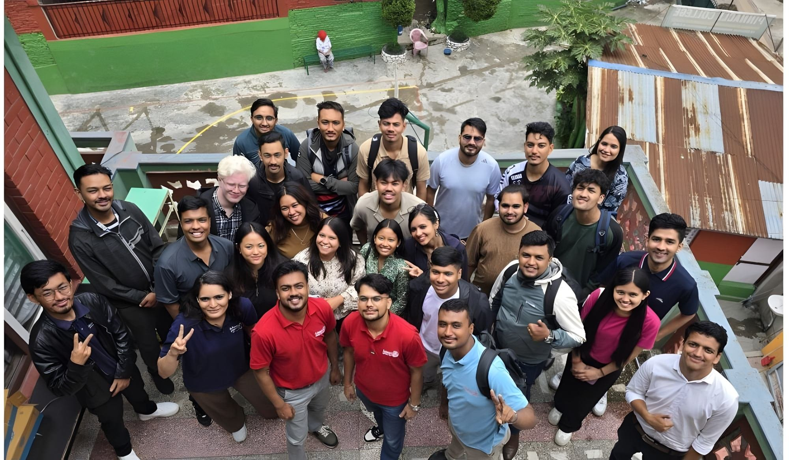
</p>

<p align="center">
  
</p>

<h1 align="center">ZONE 7 · ROTARACT DISTRICT 3292</h1>

<p align="center">
  <strong>Nepal 🇳🇵 · Bhutan 🇧🇹</strong> &nbsp;|&nbsp; 9 Rotaract clubs across the Kathmandu Valley, united in service.
</p>

<p align="center">
  <a href="https://zone7rotaract3292.vercel.app/" target="_blank"></a>
  <a href="https://ri3292zone7-cloud.github.io/zone7rotaract3292/" target="_blank"></a>
  <a href="https://www.instagram.com/zone7rotaract3292/" target="_blank"></a>
  <a href="https://opensource.org/licenses/MIT" target="_blank"></a>
</p>

<p align="center">
  
  
  
  
</p>

---

> ## 🫶 This is YOUR website.
>
> **Zone 7 Rotaract is completely open source.** Every Rotaractor, club board, alumni and friend of Zone 7 is invited — openly and without gatekeeping — to **fork this repository, make changes, and submit them**. Fix a typo, improve the code, design a new feature, translate a page, or write better documentation. This site belongs to the 9 clubs of Zone 7, not to any one person. **Your pull request is genuinely welcome.** 🚀

---

## 🌄 Who We Are

**Rotaract is Rotary International's club for young adults aged 18–30** — sponsored by local Rotary clubs and run entirely by Rotaractors. Zone 7 brings together **9 Rotaract clubs across the Kathmandu Valley** under **Rotary International District 3292 (Nepal–Bhutan)**.

From the streets of Makkhan Tol to the hills of Sankhu, our members turn service, fellowship and leadership into action — one project at a time. Whether it's a blood donation drive, an environmental clean-up, a futsal tournament, or a club assembly, Zone 7 is where young leaders from every corner of the Valley come together.

---

## 📊 Zone 7 At a Glance

| | |
|---|---|
| 🗺️ **Zones** | Zone 7, Rotaract District 3292 (Nepal 🇳🇵 · Bhutan 🇧🇹) |
| 🏘️ **Clubs in Zone 7** | **9** clubs across the Kathmandu Valley |
| 🌏 **Clubs districtwide** | 180+ Rotaract clubs |
| 👥 **Rotaractors, D3292** | 5,500+ young leaders |
| 🎂 **Age range** | 18–30 |
| 🗓️ **Current Rotary Year** | RY 2026–27 |

---

## 🏛️ The Clubs of Zone 7

Nine clubs, nine communities, one zone. Click a logo's Instagram to connect with the club.

| Club | Location | Chartered | Sponsored By | Instagram |
|---|---|---|---|---|
| 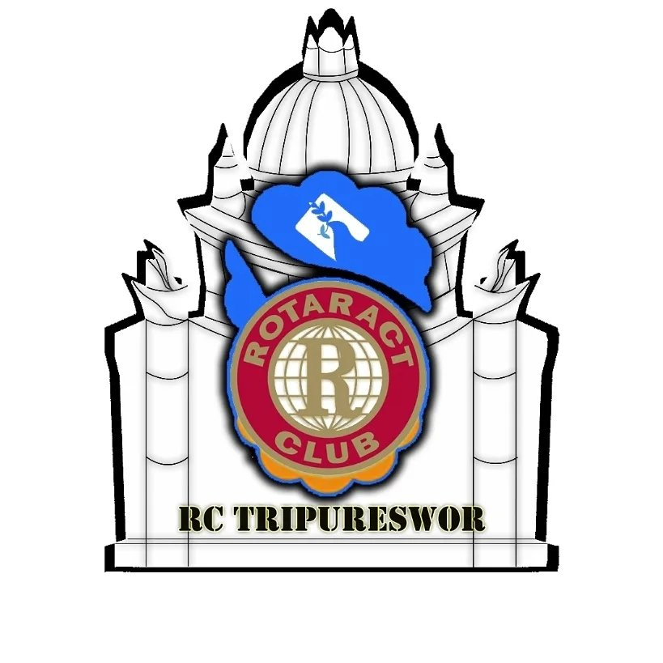 **Tripureswor** | Baneshwar, Kathmandu | 24 Nov 2003 | Rotary Club of Tripureswor | [@ractripureswor](https://www.instagram.com/ractripureswor/) |
| 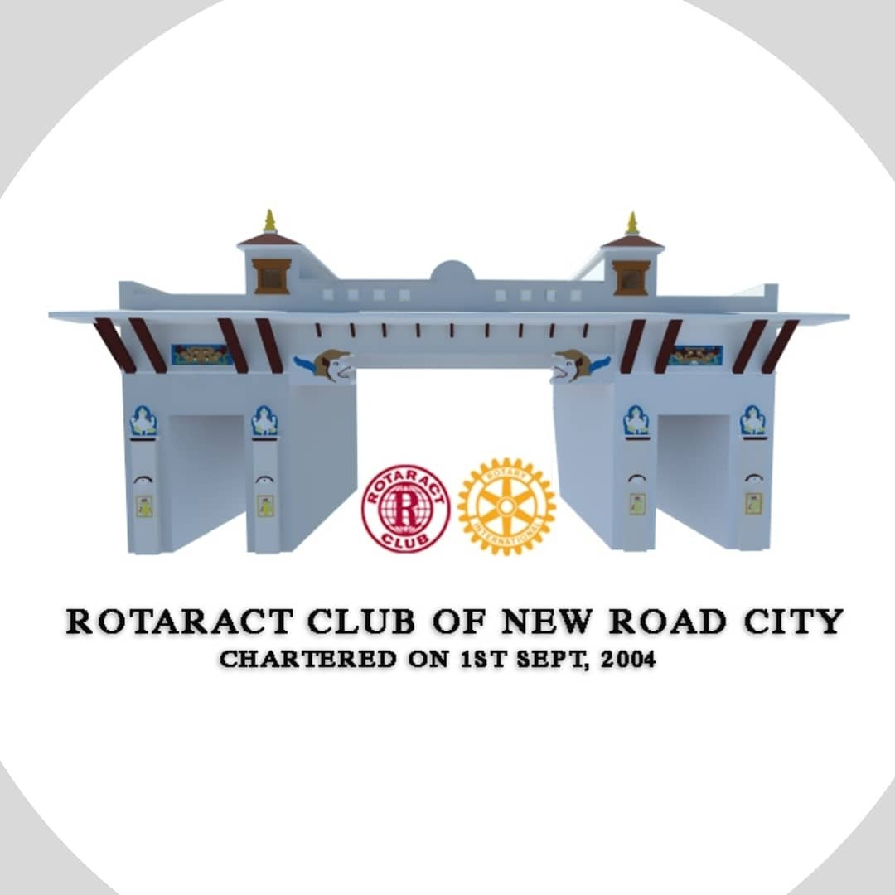 **New Road City** | Makkhan Tol, Kathmandu | 1 Sep 2004 | Rotary Club of New Road City | [@racnewroadcity1](https://www.instagram.com/racnewroadcity1/) |
| 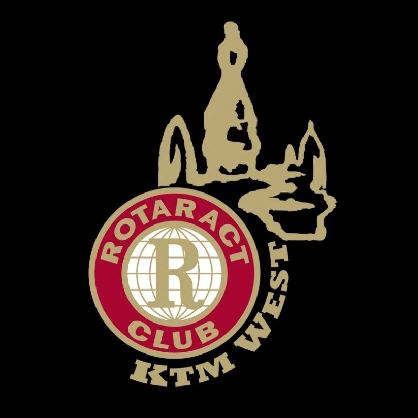 **Kathmandu West** | Baghbazar, Kathmandu | 10 Sep 2007 | Rotary Club of Kathmandu West | [@kathmanduwest](https://www.instagram.com/kathmanduwest/) |
| 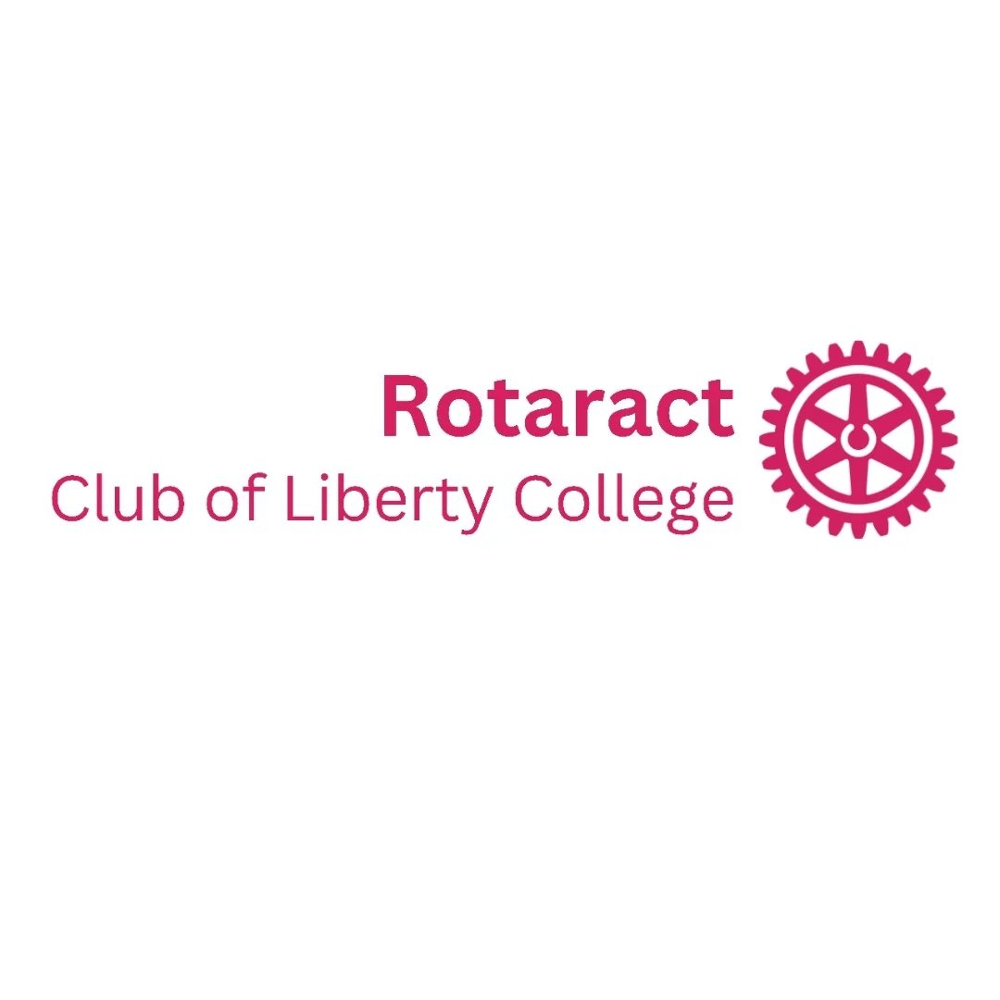 **Liberty College** | Buddha Nagar, Kathmandu | 1 May 2012 | Rotary Club of Nagarjun | [@rotaractcluboflibertycollege](https://www.instagram.com/rotaractcluboflibertycollege/) |
| 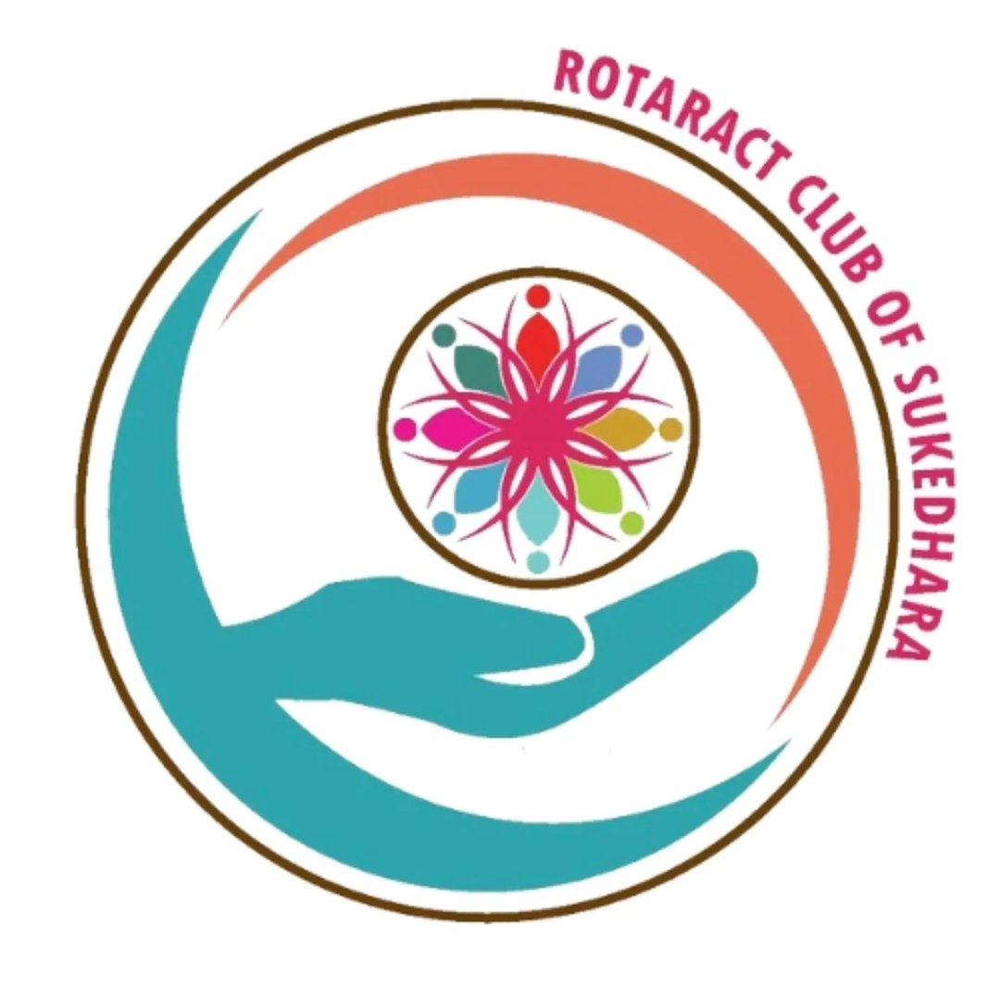 **Sukedhara** | Baneshwar, Kathmandu | 1 Jul 2019 | Rotary Club of Nagarjun | [@rac_sukedhara](https://www.instagram.com/rac_sukedhara/) |
| 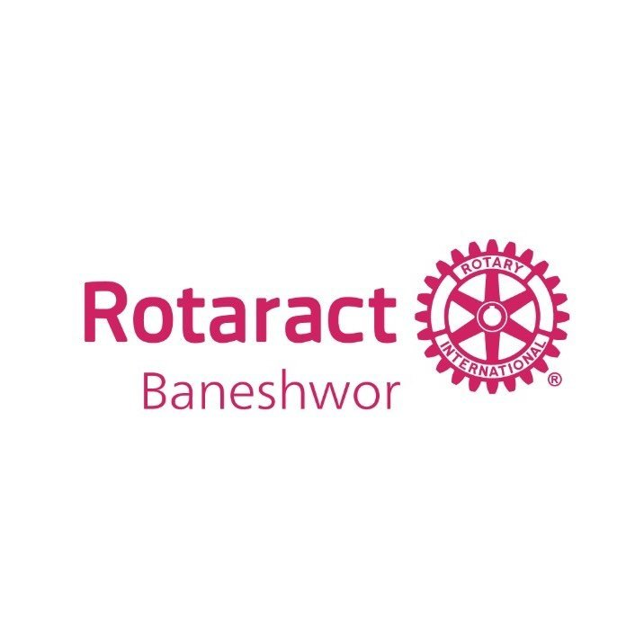 **Baneshwor** | Devkota Sadak, Kathmandu | 13 Oct 2020 | Rotary Club of Baneshwor | [@racbaneshwor](https://www.instagram.com/racbaneshwor/) |
| 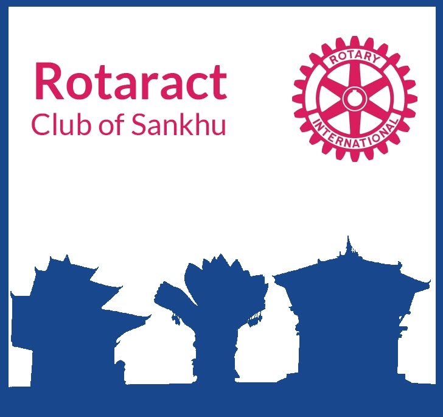 **Sankhu** | Sankhu, Kathmandu | 25 Jun 2020 | Rotary Club of Sankhu | [@racsankhu](https://www.instagram.com/racsankhu/) |
| 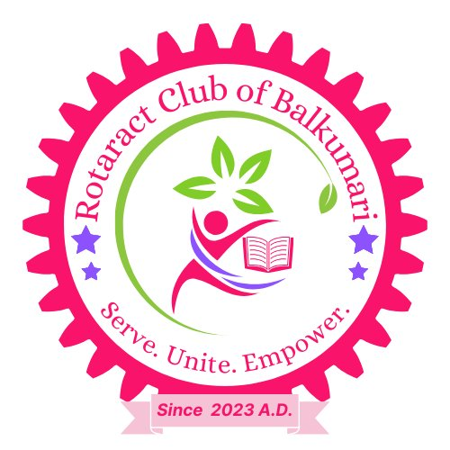 **Balkumari** | Chyasal Marg, Lalitpur | 18 Oct 2023 | Rotary Club of Butwal | [@rac_balkumari](https://www.instagram.com/rac_balkumari/) |
| 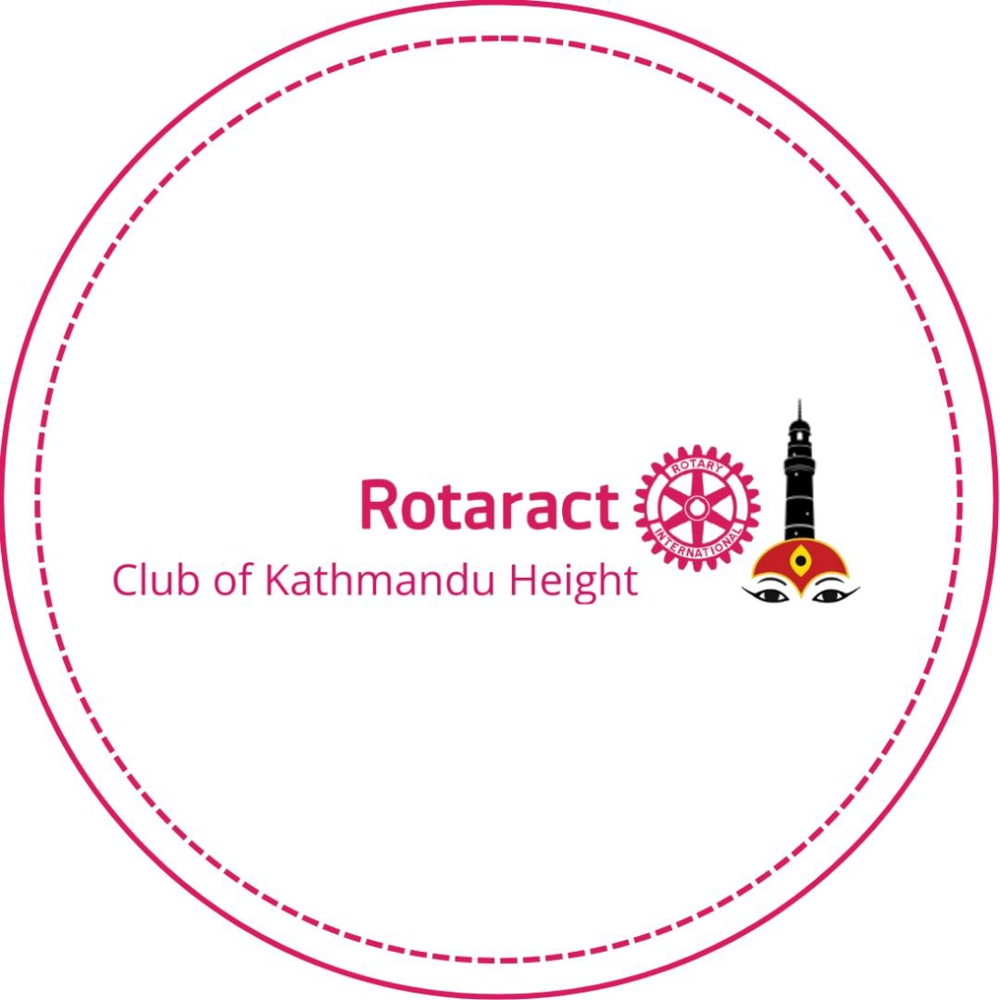 **Kathmandu Height** | Baneshwar, Kathmandu | 6 Jan 2026 | Rotary Club of Kathmandu Height | [@rackathmanduheight](https://www.instagram.com/rackathmanduheight/) |

> 💡 **Note:** *Liberty College* is our university-based club; the remaining eight are community-based clubs — and the platform adapts its excellence barometer accordingly.

---

## 👥 Zonal Leadership · RY 2026–27

Guided by a zonal team that coordinates between Zone 7's clubs and the wider District 3292 leadership.

| Role | Name | Home Club |
|---|---|---|
| 🏆 **ZRR** — Zonal Rotaract Representative | **Rtr. Rajay Bajracharya** | Rotaract Club of Sukedhara |
| 📝 **ZS** — Zonal Secretary | **Rtr. Peshal Basnet** | Rotaract Club of Liberty College |
| 🎉 **ZFC** — Zonal Fellowship Chair | **Rtr. Samrat Pandey** | Rotaract Club of Tripureswor |
| 📣 **ZPIC** — Zonal Public Image Chair | **Rtr. Rishav Thapa** | Rotaract Club of Kathmandu Height |

---

## 🕰️ A Line of Leadership — Zone 7's ZRRs, Year by Year

Every year, one Rotaractor steps up to guide the zone. This is the line so far:

| Rotary Year | ZRR | Home Club |
|---|---|---|
| 21–22 |  **Rtr. Binaya Maharjan** | Rotaract Club of Liberty College |
| 22–23 |  **Rtr. Ankush Adhikari** | Rotaract Club of Tripureswor |
| 23–24 | 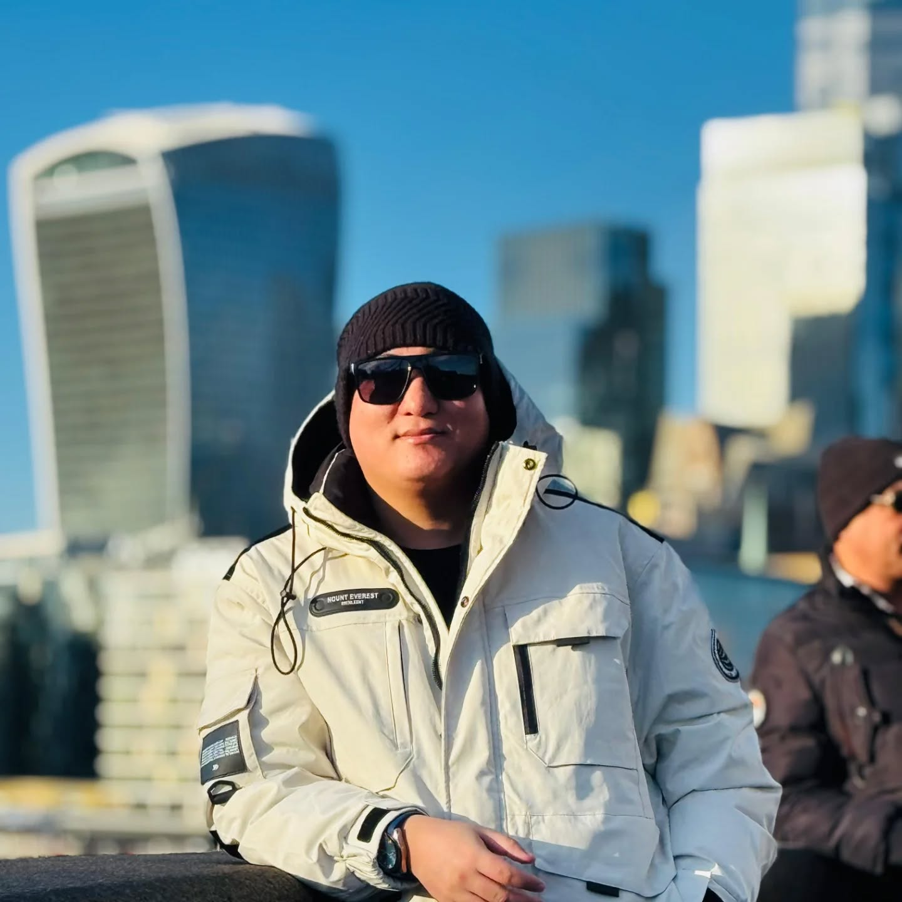 **Rtr. Gopal Shah** | Rotaract Club of Baneshwor |
| 24–25 |  **Rtr. Subina Kuickel** | Rotaract Club of Sankhu |
| 25–26 |  **Rtr. Nitesh Thakur** | Rotaract Club of Balkumari |
| **26–27** | ⭐ **Rtr. Rajay Bajracharya** *(current)* | Rotaract Club of Sukedhara |

---

## ✨ What This Website Does

A digital home for the whole zone — not just a brochure, but a living platform for the 9 clubs:

- 🧩 **Live project mosaic** — every project uploaded by Zone 7 clubs, in one skyline
- 🏘️ **Club profiles** — each club's story, board, projects and letterhead
- 📅 **District event calendar** — the full RY 2026–27 month-by-month
- 🏆 **Excellence barometer** — the District 3292 club checklist with auto-verification
- 👥 **Meet the boards** — faces of every club, year by year
- 📚 **Guides for clubs & handbooks** — Rotaract Handbook, projects, grants, health, twinship, new-club
- 🎓 **Tutorials** — board, meetings, assembly, DRR, ZRR, blood drives
- 🤖 **RotaGPT** — an AI assistant trained on Zone 7 & Rotaract knowledge
- 🛍️ **Merch store & Zonal Magazine** — flip-book reader + online shop
- 🧮 **Club tools** — meeting minutes, attendance, motions & voting templates
- 🎮 **ROTA Quiz** & selftest — knowledge, fun and fellowship
- 🔐 **Admin dashboard** — clubs log in to manage their own data

---

## 🛠️ Built With

| Layer | Technology |
|---|---|
| 🌐 **Core site** | HTML · CSS · JavaScript (fast, static, no build step) |
| ⚛️ **Companion app** | React 19 · Vite · Tailwind CSS 4 · React Router |
| 🎨 **3D & motion** | Three.js · React Three Fiber · GSAP |
| 🗄️ **Database & storage** | Supabase (PostgreSQL + Storage) |
| 🚀 **Hosting** | Vercel serverless + GitHub Pages mirror |
| 🤖 **AI assistant** | RotaGPT — DeepSeek / Pollinations powered |
| ✉️ **Email** | Nodemailer (Gmail SMTP) |

---

## 🚀 Getting Started

```bash
# 1. Clone the repository
git clone https://github.com/ri3292zone7-cloud/zone7rotaract3292.git

# 2. Enter the project directory
cd zone7rotaract3292

# 3. Serve it locally (static core)
python serve.py
# or: npx serve .

# 4. Run the React companion app (optional)
cd "React JS"
npm install
npm run dev
```

Open your browser and visit `http://localhost:3000` (or whatever local port your server prints).

---

## 🤝 Contribute — This Is Everyone's Website

**Zone 7 is built by its people.** Whether you're a seasoned developer or writing your very first pull request, this repo is your sandbox. Here's how to get involved:

1. 🍴 **Fork** this repository to your GitHub account
2. 🌿 **Create a feature branch** — `git checkout -b my-improvement`
3. ✏️ **Make your changes** — fix bugs, improve accessibility, design features, update content
4. 🚀 **Submit a pull request** — and say *namaste* in the description 🙏

### 💡 Ways you can help

- 🐛 **Fixing bugs** — spot one, squash it
- ♿ **Improving accessibility & performance**
- ✨ **Designing new features**
- 🎨 **Enhancing the user experience**
- 📝 **Updating content & documentation**
- 👀 **Reviewing code & submitting suggestions**

> 🛟 Don't know where to start? Open an **issue**, ask in the **discussions**, or reach the ZRR directly at **ri3292zone7@gmail.com**. Collaboration over competition — always.

---

## 📜 License

This project is licensed under the **MIT License**.

You are free to use, modify, distribute and sublicense this software, provided the original copyright notice and license are included in all copies or substantial portions of the software.

> 📖 A full operating runbook for maintainers lives in [OPS-README.md](OPS-README.md).

---

<p align="center">
  <strong>Service Above Self · Fellowship Through Service · Leadership Through Action</strong>
</p>

<p align="center">
  Made with ❤️ by the clubs and members of <strong>Zone 7, Rotaract District 3292 Nepal–Bhutan</strong>.
</p>

<p align="center">
  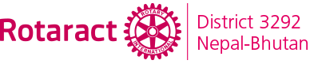
</p>
